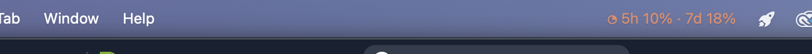

# Claudemeter

macOS menu bar indicator for Claude Code usage. Shows your unified **5-hour** and **7-day** quota utilization in real time, rendered in Claude orange.



## What it shows

The menu bar title looks like:

```
◔ 5h 47% · 7d 12%
```

Glyph reflects 5h utilization:

| Glyph | Range    |
| ----- | -------- |
| ◔     | < 50 %   |
| ◑     | 50–74 %  |
| ◕     | 75–94 %  |
| ●     | ≥ 95 %   |
| ⚠     | error    |

Click the icon to see:

- 5h utilization + reset countdown
- 7d utilization + reset countdown
- Rate-limit status
- Manual refresh

## How it works

Claudemeter reads the OAuth access token that `claude` (Claude Code CLI) stores in the macOS Keychain (`Claude Code-credentials`), then sends a 1-token `POST /v1/messages` to `api.anthropic.com` once per minute. Anthropic's response carries the rate-limit headers:

- `anthropic-ratelimit-unified-5h-utilization`
- `anthropic-ratelimit-unified-5h-reset`
- `anthropic-ratelimit-unified-7d-utilization`
- `anthropic-ratelimit-unified-7d-reset`
- `anthropic-ratelimit-unified-5h-status`

These drive the menu bar display.

> Cost: each poll consumes `max_tokens=1` (one "hi"). Negligible, but real.

## Requirements

- macOS 12+
- Python 3.10+
- You must be logged in to Claude Code (so the Keychain entry exists)

## Install & run

```bash
git clone https://github.com/Stevesibilia/claudemeter.git
cd claudemeter
./run.sh
```

`run.sh` creates a `.venv`, installs dependencies, and starts the app.

Verify your Keychain entry first:

```bash
security find-generic-password -s "Claude Code-credentials" -a "$USER" -w | head -c 20
```

## Auto-launch with Claude Code (hooks)

Claudemeter can start automatically when you open Claude Code and stop when you close the last session.

```bash
./hooks/install.sh
```

This registers two hooks in `~/.claude/settings.json`:

| Hook | Action |
|------|--------|
| `SessionStart` | Launches Claudemeter if not already running |
| `SessionEnd` | Kills Claudemeter only when the **last** Claude session closes |

Multiple Claude windows are safe — the stop hook counts running sessions before killing.

Logs land in `/tmp/claudemeter.log`.

To uninstall:

```bash
./hooks/uninstall.sh
```

Removes both hooks from `~/.claude/settings.json` and stops Claudemeter.

## Run on login (optional)

Drop a launchd plist in `~/Library/LaunchAgents/`. Example template:

```xml
<?xml version="1.0" encoding="UTF-8"?>
<!DOCTYPE plist PUBLIC "-//Apple//DTD PLIST 1.0//EN" "http://www.apple.com/DTDs/PropertyList-1.0.dtd">
<plist version="1.0">
<dict>
  <key>Label</key><string>local.claudemeter</string>
  <key>ProgramArguments</key>
  <array>
    <string>/Users/YOU/Homelab/Tools/claudemeter/run.sh</string>
  </array>
  <key>RunAtLoad</key><true/>
  <key>KeepAlive</key><true/>
  <key>StandardOutPath</key><string>/tmp/claudemeter.out.log</string>
  <key>StandardErrorPath</key><string>/tmp/claudemeter.err.log</string>
</dict>
</plist>
```

Load: `launchctl load ~/Library/LaunchAgents/local.claudemeter.plist`

## Credits

Inspired by **[Clawdmeter](https://github.com/HermannBjorgvin/Clawdmeter)** by [Hermann Björgvin](https://github.com/HermannBjorgvin) — an ESP32 desk dashboard for Claude Code usage. Claudemeter reuses the same approach for reading the OAuth token from the macOS Keychain and parsing Anthropic's unified rate-limit headers, but drops the BLE/ESP32 transport in favor of a native macOS menu bar widget (rumps + PyObjC).

If you want a physical desk indicator, check Clawdmeter — it is excellent.

## License

MIT — see [LICENSE](LICENSE).
